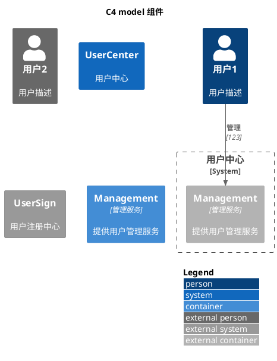

<!--
 * @Description: insert description
 * @Author: yangrongxin
 * @Date: 2026-03-31 16:44:24
 * @LastEditors: yangrongxin
 * @LastEditTime: 2026-04-02 16:58:30
-->
# c4 model 的实现

## demo1

各类组件的呈现

