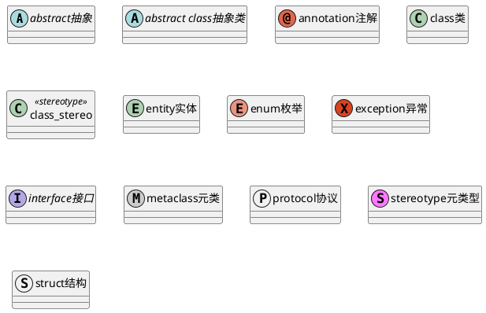
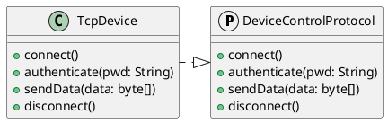
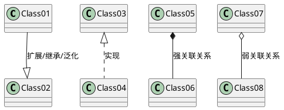
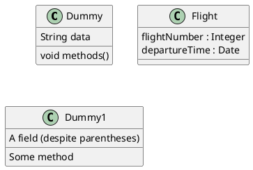
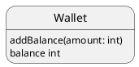
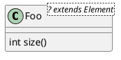
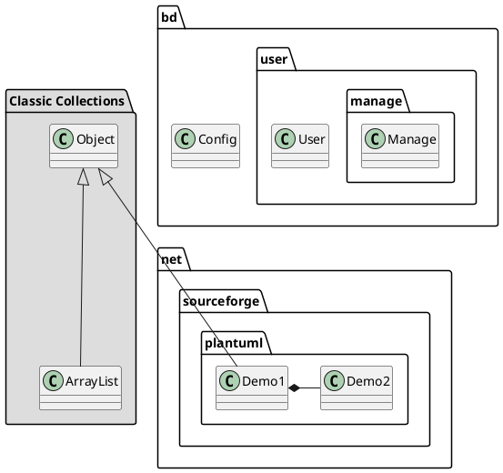

# 类图的实现

一般用于 L4的code图，但是由于是静态图，不能很好的体现业务，所以需要配合其他图一起使用。

## demo1

基础语法

## demo2

实现一个 protocol

## demo3

类之间的关系实现

.. 代表虚线，-- 代表实线，> 代表实心箭头，|> 代表空心箭头，* 代表菱形，O 代表空心菱形。

## demo4

给类增加方法名称

## demo5

增加一个泛型

## demo6

增加一个包的概念。如果一个结构包装了一个类，那么这个结构多半是作为包进行使用的。

