<!--
 * @Description: 这里存放序列图的plantUML实现
 * @Author: yangrongxin
 * @Date: 2026-03-31 11:17:01
 * @LastEditors: yangrongxin
 * @LastEditTime: 2026-04-07 17:31:53
-->

# 序列图的实现

## demo1

序列图的简单实现。
Alice 向 Bob 发送 Hello，得到 ok 返回。

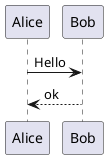

## demo2

不同的uml语言之间的复用 - 有问题估计现在已经不被支持了。

## demo3

尝试解析PDCA的流程

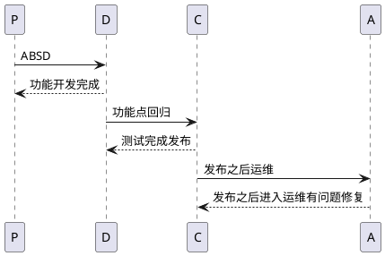

## demo4

不使用return来定义返回消息，而使用箭头来进行定义。

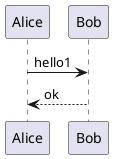

## demo5

声明参与者，声明在序列图上的几种不同类型的参与者

order 属性可以改变参与者的显示顺序

#color 属性可以改变参与者的颜色

create 参与者名称：可以创建一个自定义的参与者，这个创建的参与者需要定义在需要使用它的序列图之前

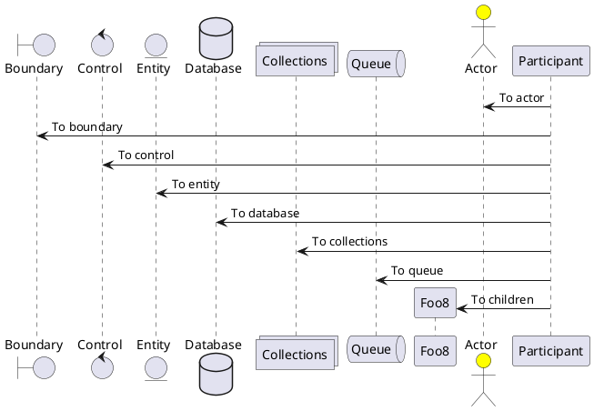

## demo6

给自己发消息，不同的方向代表不同的消息呈现。

autonumber 初始值：代表给消息自动加上编号，没有初始值的时候默认从1开始，有初始值的时候从初始值开始。

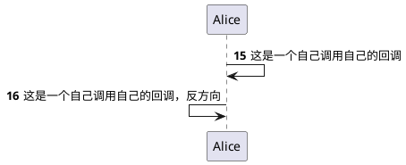

## demo7

标题以及页脚的定义

header 属性可以定义页面的标题

footer 属性可以定义页脚

title 属性可以定义标题

newpage 创建新的页面

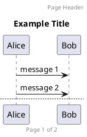

## demo8

组合消息 - 画个框把内容放在一起。组合消息的作用把放在一起的功能框在一起。

alt/else: alt画框，else展示一个分界线。

opt、loop、par、break、critical 子标签: 生成对应名称的框。

group 框名 [框的子标签名]: 画框同时支持自定义框名。

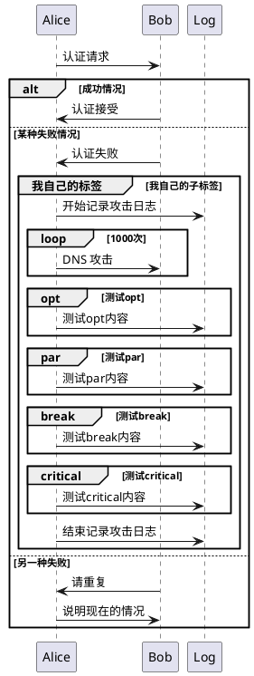

## demo9

note left: 在当前序列的左边增加一个注释

note right: 在当前序列的右边增加一个注释

note over Bob: 在 Bob 的序列图上增加一个注释

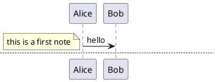

## demo10

文本使用 \n 进行换行

段落之间使用 ||60|| 或者 ||| 增加间距

使用 autoactivate on 来生成参与者的生命线，会根据你的参与者之前的消息关系自动进行对应的生成。

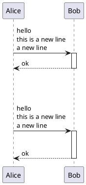

## demo11

软件工程活动的定义

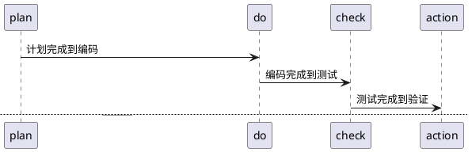
## demo12

apisix 访问流程

生命线的激活与取消 activate / deactivate + 实体名称

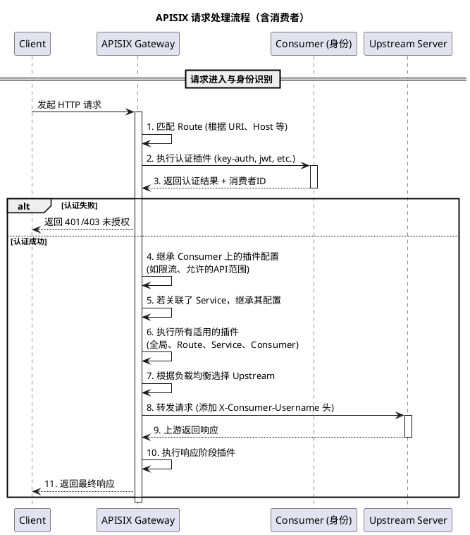