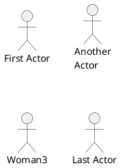
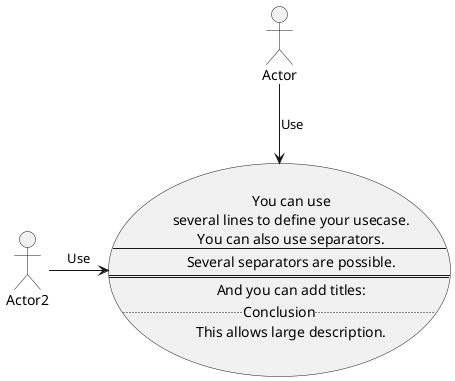
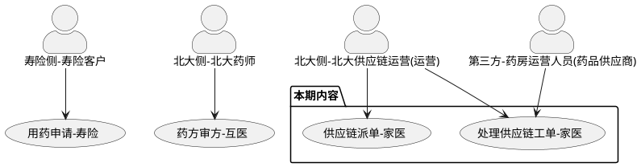
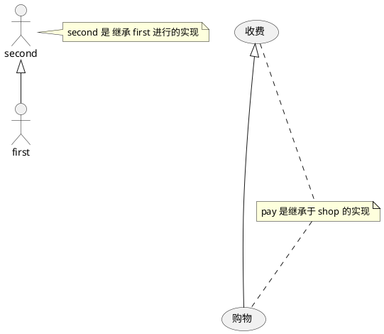
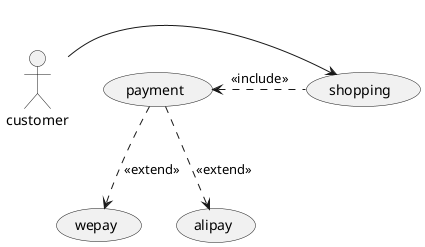

<!--
 * @Description: insert description
 * @Author: yangrongxin
 * @Date: 2026-04-01 09:35:58
 * @LastEditors: yangrongxin
 * @LastEditTime: 2026-04-08 09:44:08
-->
# 用例图的实现

## demo1

用例的呈现

```plantuml
@startuml

 
@enduml
```

## demo2

外部参与者的实现



## demo3

用例中的多文本描述实现

使用 --(从上往下链接) 或者 -(从左往右链接) 来链接角色与用例



## demo4

包的实现




## demo5

继承关系实现 B 继承 <|-- A 实现。

注释通过 note xxx of xxx: content，来给指定的元素增加注释。



## demo6

使用 ..> 或者 <.. 来实现虚线，一样是 . 表示水平关系，.. 表示垂直关系。



